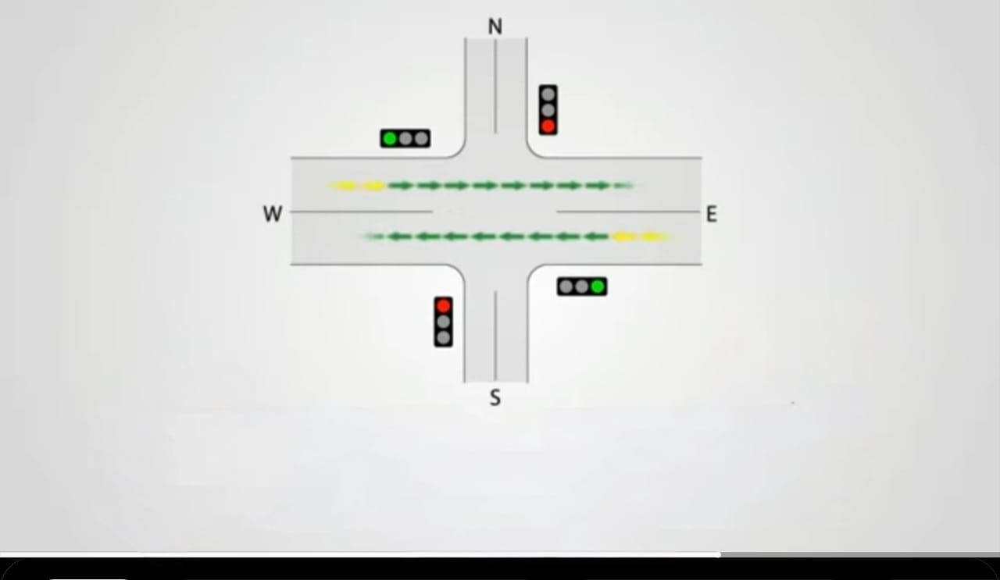
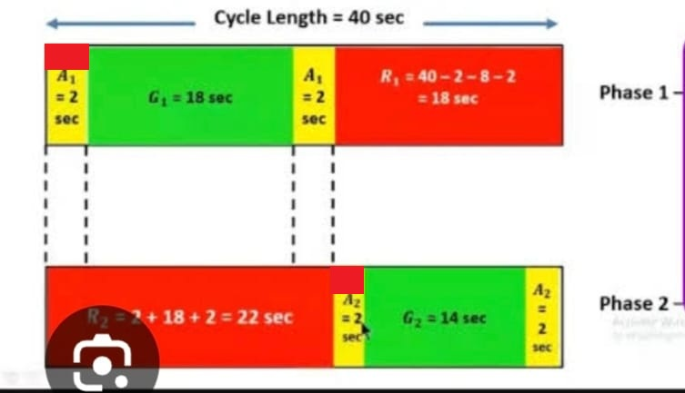
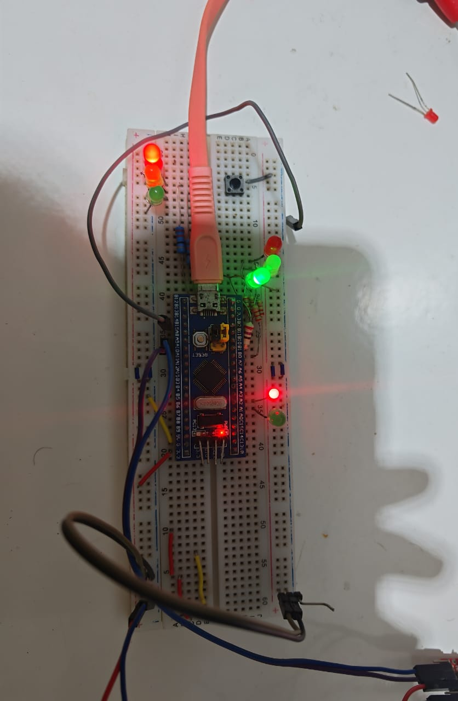
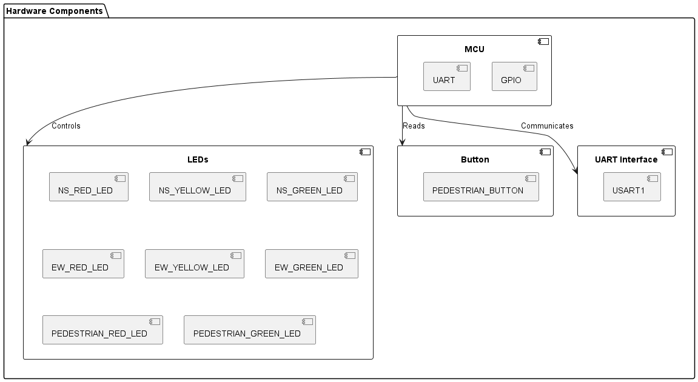
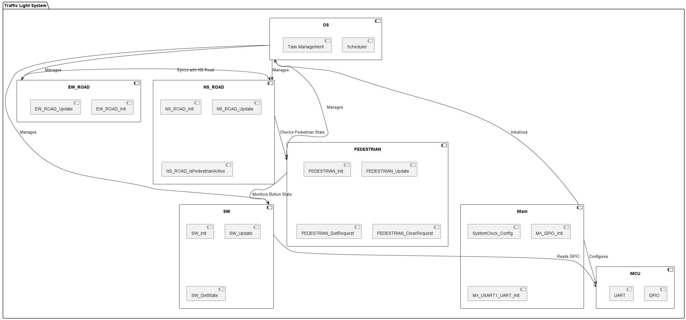
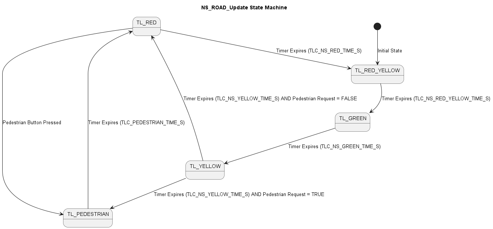
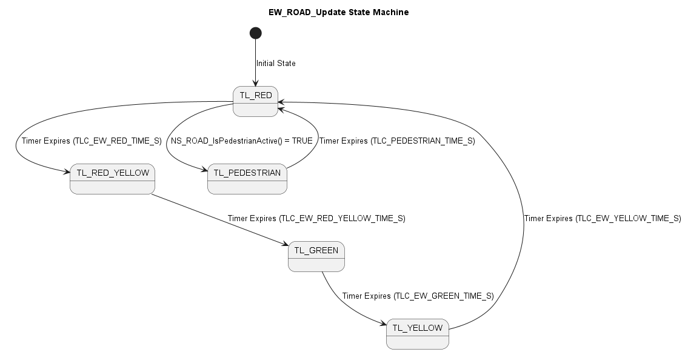
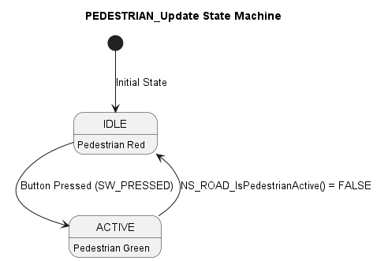
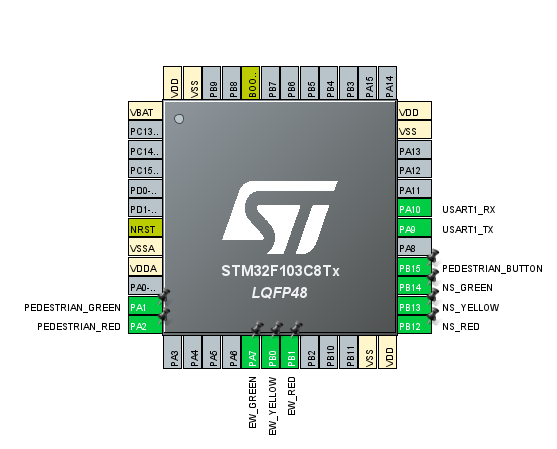

# Traffic Light Control System

## Overview
This project implements a **traffic light control system** for a four-way intersection using a **Real-Time Operating System (RTOS) with Finite State Machine (FSM)**. The system controls traffic lights for **North-South (NS)** and **East-West (EW)** roads and includes a **pedestrian crossing feature**. The implementation is based on the STM32 microcontroller.

#### Refrance Design 


---

## Hardware Setup



- **Microcontroller**: STM32
- **LEDs**:
  - **North-South Road**:
    - Red, Yellow, Green LEDs
  - **East-West Road**:
    - Red, Yellow, Green LEDs
  - **Pedestrian Signals**:
    - Red (Don’t Walk), Green (Walk) LEDs
- **Button**:
  - Pedestrian crossing request button
- **UART Interface**:
  - For debugging and logging (optional)


---

## Software Design
### RTOS Tasks
The system is divided into multiple tasks managed by an RTOS:
1. **`NS_ROAD_Update`**:
   - Controls the North-South traffic lights.
   - Manages state transitions (Red → Red-Yellow → Green → Yellow → Red).
2. **`EW_ROAD_Update`**:
   - Controls the East-West traffic lights.
   - Synchronizes with the North-South road.
3. **`PEDESTRIAN_Update`**:
   - Manages pedestrian crossing logic.
   - Activates pedestrian mode when the button is pressed.
4. **`SW_Update`**:
   - Monitors the pedestrian button state.
   - Detects button presses and triggers pedestrian mode.


### States
The traffic lights operate in the following states:
- **`TL_RED`**: Red light is on.
- **`TL_YELLOW`**: Yellow light is on.
- **`TL_GREEN`**: Green light is on.
- **`TL_RED_YELLOW`**: Red and yellow lights are on (transition state).
- **`TL_PEDESTRIAN`**: Pedestrian crossing is active (both roads are red).

---

## State Diagram
Below is the state diagram for the traffic light system:




---


---

## Setup Instructions
1. **Clone the Repository**:
   ```bash
   git clone https://github.com/your-username/traffic-light-system.git
   ```
2. **Open the Project**:
   - Open the project in your IDE (STM32CubeIDE).
3. **Build and Flash**:
   - Build the project and flash it to the STM32 microcontroller.
4. **Hardware Connections**:
   - Connect the LEDs and button to the GPIO pins as defined in `main.c`.
   - Connect the UART interface for debugging (optional).


---

## Code Structure
- **`main.c`**:
  - Initializes the system, GPIO, and UART.
  - Creates RTOS tasks and starts the scheduler.
- **`ns_road.c`**:
  - Implements the North-South traffic light logic.
- **`ew_road.c`**:
  - Implements the East-West traffic light logic.
- **`pedestrian.c`**:
  - Manages pedestrian crossing logic and button monitoring.
- **`sw.c`**:
  - Handles the pedestrian button state.
- **`os.c`**:
  - Implements the RTOS scheduler and task management.

---

## Testing & Validation
- **Normal Operation**:
  - The traffic lights cycle through Red → Red-Yellow → Green → Yellow → Red.
- **Pedestrian Mode**:
  - When the pedestrian button is pressed, both roads turn red, and the pedestrian signal turns green.
- **Debugging**:
  - UART logs can be used to monitor state transitions and button presses.

---

## Demo
- A short demo video showing the system in action can be found [here](#) (optional).

---

## Additional Features (Optional)
- **Blinking Yellow Light**:
  - Add a blinking yellow light to warn pedestrians before the light turns red.
- **UART Logging**:
  - Log state changes and button presses for debugging.
- **Power Saving**:
  - Put the MCU in sleep mode between the ticks.
- **Distriputed systems**:
  - Make the system more reliable.
  **Backup MUC**:
  - Make the system more safer.
---

## Challenges
- **Task Synchronization**:
  - Ensuring proper synchronization between tasks (e.g., pedestrian mode and traffic light states).
- **Timing**:
  - Managing timers for state transitions and pedestrian mode.


---

## Contact
For questions or feedback, please contact:
- **Eslam Shahin**
- Email: eslamshahin552000@gmail.com

